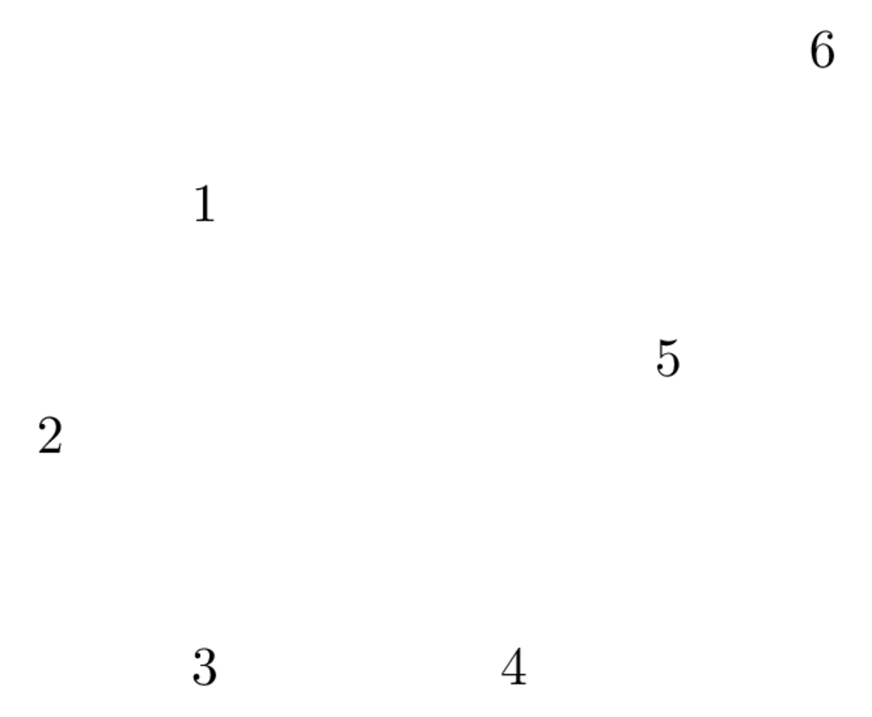
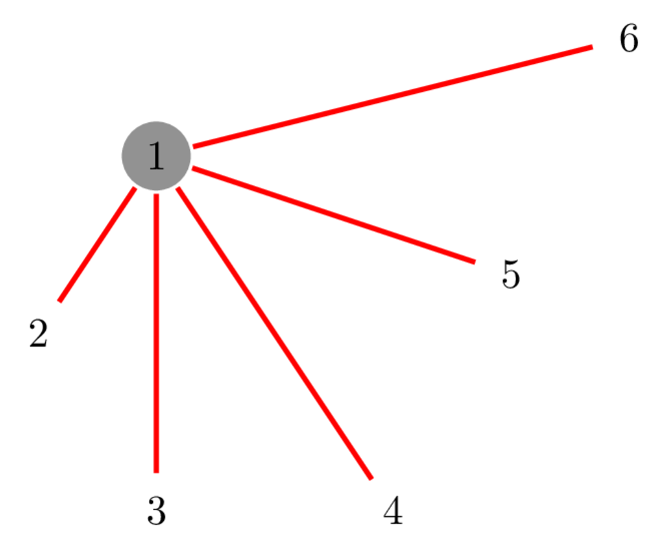
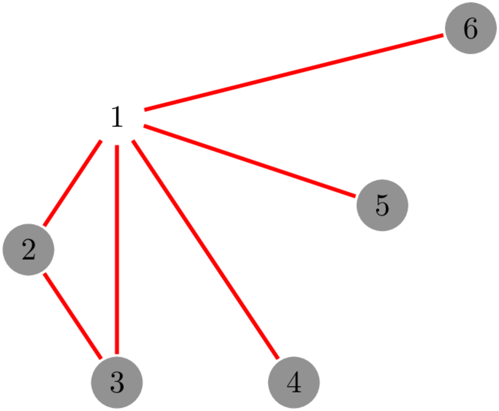
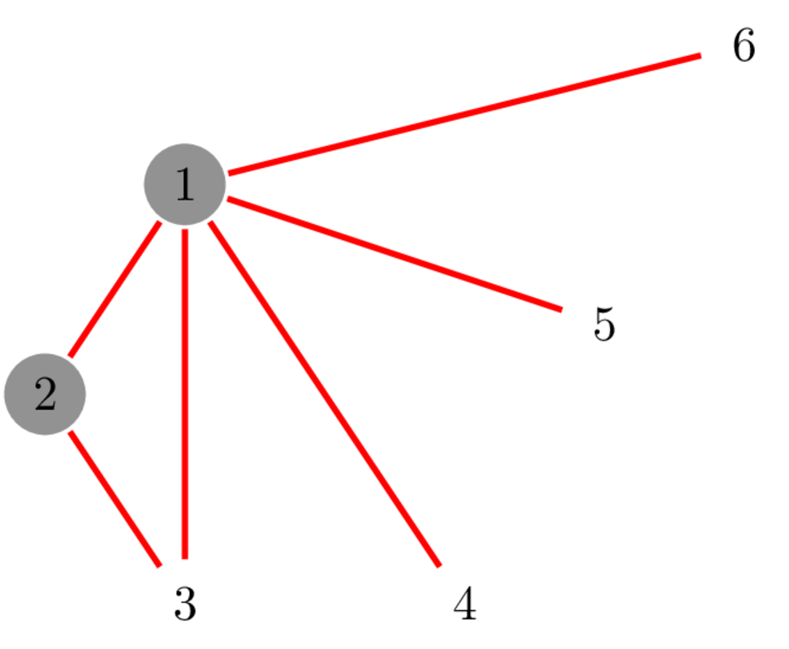
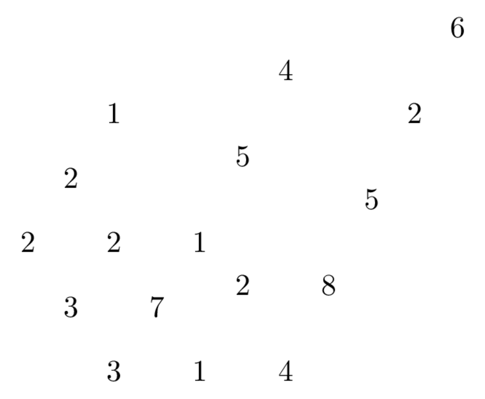
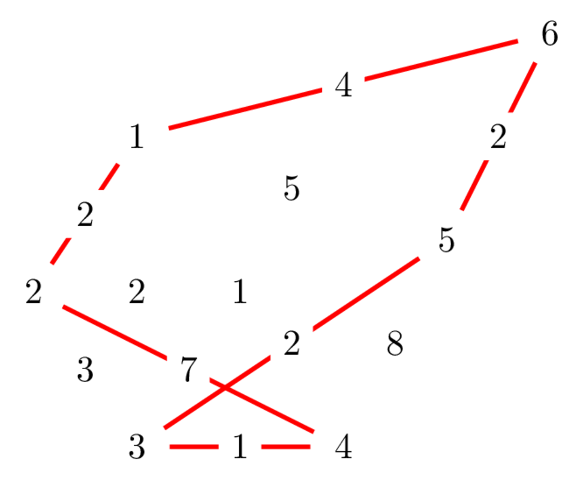

@title[NPHard Tricks]
## Tricks på exp-problem
#### Måns Magnusson UVS progläger 2018

---

### Greedy funkar inte, sökspace är >=exp

- Minimal Vertex Cover
- Traveling Salesman Problem (TSP)
- [Karp's 21 NP-complete problems](https://en.wikipedia.org/wiki/Karp%27s_21_NP-complete_problems)

---

### Åtgärder:

- Bitmask DP
- Meet In The Middle

---

### ~~Vertex~~ Cover

En cover är en delmängd av noderna så att alla kanter är täckta av minst en nod.



---

### ~~Vertex~~ Cover
Inte en cover



---

### ~~Vertex~~ Cover
En cover!



---

### ~~Vertex~~ Cover
```python
def is_cover(s: set, edgs: list(tuple)):
    for u, v in edgs:
        if u not in s and v not in s:
            return False
    return True
```

---

### Minimal Vertex Cover
Hitta den delmängd av noder med minst storlek som är en cover


---
### Minimal Vertex Cover
Hitta den delmängd av noder med minst storlek som är en cover




---

### Naiv lösning till Vertex Cover
```python
def MinVC(n, edgs):
    min_size = n
    for subset in generate(n):
        if is_cover(subset, edgs):
            min_size = min(min_size, len(subset))
    return min_size
```
@[1-3]
@[1-6]

---

### Generera alla subset:
```python
def generate(n: int):
    if n == 1:
        return [set(), set([0])]
    subsets = generate(n-1)
    withn = []
    for s in subsets:
        s_withn = s.copy()
        s_withn.add(n-1)
        withn.append(s_withn)
    return subsets + withn
```
@[1-3]
@[1-5]
@[1-10]

---

### Generera alla subset som tal:
```python
def generate(n: int):
    if n == 1:
        return [0, 1]
    subsets = generate(n-1)
    withn = []
    v = 1<<(n-1)
    for s in subsets:
        withn.append(s | v)
    return subsets + withn
```

---

### Generera alla subset som tal, bättre:
```python
def isCover(s, edgs):
    for u, v in edgs:
        if (1<<u)&s == 0 and (1<<v)&s == 0:
            return False
    return True

def generate(n: int):
    return list(i for i in range(1<<n))
```
@[1-5]
@[1-8]

---

### bitmask:

- Koda subset med tal
- För VC: |E| * 2^n

---

### TSP:
I en viktad graf, hitta den billigaste cykeln som besöker alla noder exakt en gång.



---

### TSP:
I en viktad graf, hitta den billigaste cykeln som besöker alla noder exakt en gång.




---

### lös TSP på n! tid


---

### Hur många olika inputs kan f ha?

---

### Bitmask DP!

---

### Tidskomplexitet?

---

### Kommer ni ihåg MVC?

Hitta den delmängd av noder med minst storlek som är en cover


---

### Idé: Dela grafen i 2 halvor A, B

- Efter nodnumrering

---

### Idé: Dela grafen i 2 halvor A, B

Om vi har en delmängd A' av A vill vi hitta:
den minsta delmängden av B som gemensamt med A' är en MVC.

rita, Måns!

---

### Idé: Dela grafen i 2 halvor A, B

Det finns tre typer av kanter:
- A - A
- A - B
- B - B

---

### Givet en delmängd A' av A som täcker alla A-A kanter

Vilka noder _måste_ användas i B?

---

### Minimalt antal noder att lägga till för att täcka alla B - B kanter?
DP! :D

---
### Tidskomplexitet?

---

### Problem på bitmask och MITM:

- [Kattis: Indoorienteering](https://open.kattis.com/problems/indoorienteering)
- [Kattis: Fancy Antiques](https://open.kattis.com/problems/antiques)
- [Kattis: Easter Eggs](https://open.kattis.com/problems/eggs)
- [Kattis: Safe Passage](https://open.kattis.com/problems/safepassage)
- [CF: Mother of Dragons](http://codeforces.com/problemset/problem/839/E)

